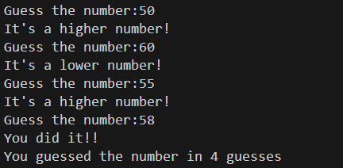

# 🎯 Number Guessing Game (C)

## 📌 Description
This is a simple **Number Guessing Game** written in C.  
The program randomly generates a number between **1 and 100**, and the player must guess it. After each guess, the program provides hints to guide the player until the correct number is found.

---

## ⚙️ How It Works
1. The program seeds the random number generator using the current system time.
2. A random number between **1 and 100** is generated.
3. The user is prompted to guess the number.
4. After each guess:
   - If the guess is **too high**, the program displays a hint.
   - If the guess is **too low**, the program displays a hint.
   - If the guess is **correct**, the game ends.
5. The total number of guesses is displayed.

---

## 🧰 Requirements
- C Compiler
- Standard C libraries:
  - `stdio.h`
  - `stdlib.h`
  - `time.h`

---

## 🤗 Sample Output

---

## 🔃 Further Updates
- Limit the number of guesses
